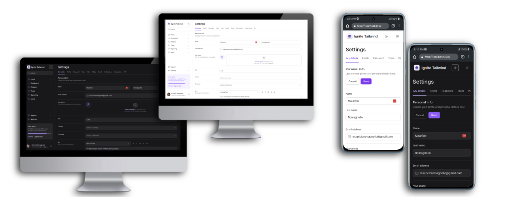

# **ignite-tailwind**



## Techs

- [Next.js](https://nextjs.org/) - The React Framework for Production.
- [Tailwindcss](https://tailwindcss.com/) - A utility-first CSS framework for rapidly building custom designs.
- [Radix UI](https://www.radix-ui.com/) - A collection of open source UI components for React to accessibility.
- [Framer Motion](https://www.framer.com/motion/) - A production-ready motion library for React.
- [Lucide React](https://lucide.dev/guide/packages/lucide-react) - A simply beautiful open source icons.
- [Auto Animate](https://auto-animate.formkit.com/) - A tool to create animations with Framer Motion.
- [Tailwind Variants](https://www.tailwind-variants.org/) - A tool to create custom variants for Tailwindcss.
- [Tailwind Merge](https://github.com/dcastil/tailwind-merge) - A tool to merge Tailwindcss classes.

## Running

First, install the version 20.8.1 of node.js. Then, install the dependencies:

```bash
npm ci
```

Then, run the development server:

```bash
npm run dev
```

Open [http://localhost:3000](http://localhost:3000) with your browser to see the result.

## Learnings

- Using Radix UI components
- Using Tailwind Merge
- Tailwind Variants and Slots API
- Animations with Framer Motion and Auto Animate
- Using Lucide React icons
- Dark/Light theme with Tailwindcss and Theme Switcher
